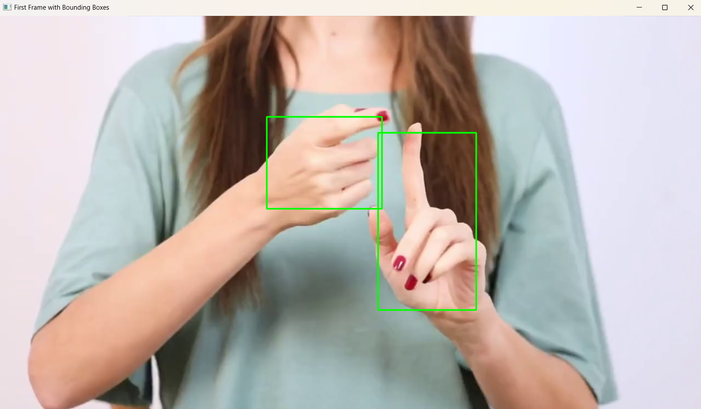

# Automatic Hand Tracking Using SAM 2

## Project Overview
This project uses **MediaPipe** and **SAM 2 (Segment Anything Model 2)** to automatically detect and track hands in a video. It generates a video with colorized overlays highlighting the tracked hands.

## Features
- Detect hands in the first frame using MediaPipe.
- Track hand movements across video frames using SAM 2.
- Generate a video with colorized masks overlaying the hands.
- Post-process video to adjust overlay opacity.

## Installation
1. Clone this repository:
   ```bash
   git clone https://github.com/Anuj-Attri/AutoHandTracking.git
   cd AutoHandTracking
   ```
2. Set up the Python environment:
   ```bash
   conda create -n sam2 python=3.12
   conda activate sam2
   pip install -r requirements.txt
   ```
3. Install SAM 2:
   ```bash
   git clone https://github.com/facebookresearch/sam2.git
   cd sam2
   pip install -e .
   ```
4. Download the `sam2.1_hiera_l.pt` file from sam2 repository and paste it in the checkpoints folder.
## Usage
### Step 1: Detect Hands in the First Frame
Run:
```bash
python detect_hands.py
```
Example output from Part 1:


### Step 2: Track Hands Across the Video
Run:
```bash
python track_hands.py
```

### Optional: Adjust Overlay Opacity
Run:
```bash
python adjust_overlay.py
```

## File Structure
```
├── detect_hands.py          # Detect hands in the first frame
├── track_hands.py           # Track hands across frames
├── adjust_overlay.py        # Adjust overlay opacity (post-processing)
├── checkpoints/             # SAM 2 model checkpoints
├── data/                    # Input/output video files
├── requirements.txt         # Python dependencies
└── README.md                # Project documentation
```

## Output
- **Input Video**: `test.mp4` (raw video showing hands).
- **Output Video**: `output.mp4` (colorized masks highlighting hands).

## Contributing
Feel free to open issues or submit pull requests to improve the project!
